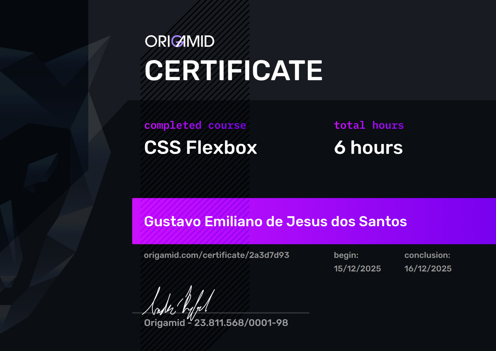

<div align="center">
      <br><br>
</div>


# **🚴‍♂️ FlexBlog Web Site**


A fictional blog website developed with **HTML5** and **CSS3**, focusing on the practical use of **CSS Flexbox** to build flexible, responsive, and well-structured layouts.

This project was developed during the **CSS Flexbox** course at **<a href="https://www.origamid.com/">Origamid</a>**, aiming to consolidate front-end fundamentals such as semantic markup, layout organization, responsiveness, and best practices in CSS.


<br>
<div align="center">
  <strong>Home interface of the project</strong><br><br>
  
</div>
<br>


## **📌 About the Project**

**FlexBlog** simulates a modern blog layout, composed of multiple sections such as menu, content, products, pricing, quality, and footer.  

The main objective is to practice and solidify the use of **CSS Flexbox** for layout construction, alignment, spacing, and responsiveness, using only **native web technologies**.

## **:mag_right: Features**

✔️ Responsive layout (desktop, tablet, and mobile)

✔️ Use of semantic HTML

✔️ Modern styling with CSS

## 📁 Project Structure

The project structure was organized to facilitate maintenance, scalability, and code understanding.

```text
flexblog/
├── assets/             # Images not directly related to the project
├── certificado/        # PDF certificate file
├── css/                # Style files (CSS)
├── img/                # Images and project assets
├── index.html          # Home page
├── LICENSE             # MIT License
└── README.md           # Project information
```

---

## **🛠️ Technologies Used**

-   
  : Used to structure web pages in a semantic way.

-   
  : Used for styling, responsive layout, and website design.

---

## **📂 Installation and Usage**

> **Step 1:** Clone this repository by typing in your terminal:  
> `git clone https://github.com/GustavoEmiliano/flexblog.git`

> **Step 2:** Navigate to the cloned directory and open it using Visual Studio Code (VSCode);

> **Step 3:** Install the `Live Server` extension;

> **Step 4:** Right-click on the `index.html` file located at the project root;

> **Step 5:** Click on the **Open with Live Server** option;

> **Step 6:** Browse the web application and test its features.

---

## **💻 Deploy**

This project is hosted on **Vercel**, a platform widely used for deploying front-end applications.
<a href="https://flexblog-eta.vercel.app/">View the deployed application</a>

---

## **📝 License**

Licensed under the [MIT License](./LICENSE)

---

## **🌱 Contributing**

> **Step 1:** `fork` this repository  
> **Step 2:** Add a new branch with your feature: `git checkout -b my-feature`  
> **Step 3:** Commit your changes: `git commit -m "feat: my new feature"`  
> **Step 4:** Push to your branch: `git push origin your-branch`  
> **Final:** After merging your pull request, you can delete your branch.

---

## **✒️ Developer**

- Gustavo Emiliano de Jesus dos Santos<br><br>
  <a href="https://www.linkedin.com/in/gustavo-emiliano-936341294/" target="_blank">
    
  </a>
  <a href="mailto:gustavoemiliano2014@gmail.com">
    
  </a>
  <a href="https://github.com/GustavoEmiliano">
    
  </a>

## **🎓 Course Certificate**
This project was developed as part of the **CSS Flexbox course by <a href="https://www.origamid.com/">Origamid</a>**.
The course certificate confirms the completion of all modules, focusing on the practical application of CSS Flexbox, layout structuring, alignment, responsiveness, and best practices in modern front-end development.

<div align="center">
  <a href="https://www.origamid.com/certificate/2a3d7d93" target="_blank">
    
  </a>
</div>

<div align="center"><br>
  Thank you for visiting the FlexBlog repository!
</div>

---

<div align="center">
FlexBlog - &copy; 2025
</div>


